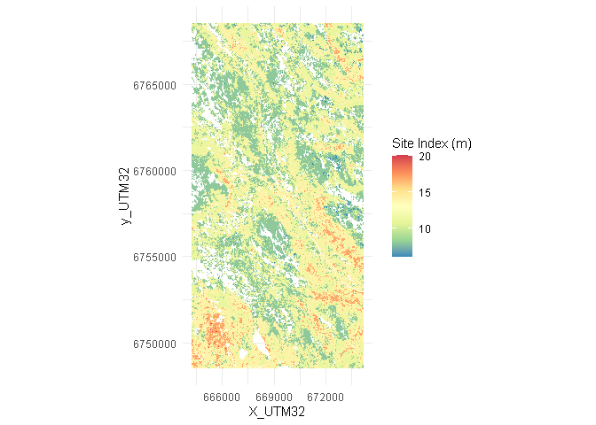

<!-- README.md is generated from README.Rmd. Please edit that file -->
<!-- badges: start -->
<!-- badges: end -->


# PixSim

## Overview

**PixSim** is a flexible, cross-platform, open-source tool designed for
stand-level forest growth simulations. It operates at the pixel level
using high-resolution, wall-to-wall forest resource maps.

## Installation

You can install the development version of PixSim from
[GitHub](https://github.com/) with:

``` r
# install.packages("devtools")
devtools::install_github("nicoscattaneo/PixSim")
```

## General usage

### Example 1

Simulate 15 years of forest growth for a 10x20 km region in central
Norway using stand-level growth models of the main species groups in
Norway. The simulation is conducted in 5-year intervals, with the
results of each time step saved locally for further analysis. For
detailed model information, see [Maleki et
al. 2022](https://doi.org/10.1080/02827581.2022.2056632).

``` r
library("PixSim")
library("data.table")

## See below in the "Basic usage - Pixeltable" section to learn 
## how to create a PixelTable from forest resource maps.
head(PixelTable, 3)
#>    x_UTM32 y_UTM32 Age B_m2ha   N SI_m Species   Stand V_m3ha  H_m
#> 1:  664232 6748520  71     20 514   14       2 1093264    170 19.3
#> 2:  664232 6748536  65     21 578   14       2 1093264    175 18.4
#> 3:  664232 6748552  82     19 436   14       2 1093264    172 20.9
dim(PixelTable)
#> [1] 661521     10

## Here we use a function that implement stand-level 
## growth models of the main species groups in Norway
Functions <- list(GrowthModels = GrowthModels)

## "GrowthModels" function needs equations and parameters to be specified.
args(GrowthModels)
#> function (Data, ModelsAndParameters, nSpecies) 
#> NULL
myMM <- ModelsAndParameters[[1]]

## Species codes
mySSP <- c(1, 2, 3)

## A local folder where simulation results should be written.
Fold <- tempfile()
dir.create(Fold)

PixSim(Data = PixelTable,
       Np = 3, ## 3 5-year projections
       nSpecies = mySSP,
       functions = Functions,
       WriteOut = TRUE,
       LocalFldr = Fold,
       ModelsAndParameters = myMM)

## Check the results
## Results <- list.files(Fold, full.names = TRUE)
## lapply(Results, fst::read_fst, as.data.table = TRUE, from = 1, to = 5)
```

------------------------------------------------------------------------

### Example 2

There are also functions available to initialize pixels after the forest
has been harvested:

``` r
Functions <- list(GrowthModels = GrowthModels,
                  RegFunction = RegFunction, 
                  PostRegFunction = PostRegFunction)

myMM <- ModelsAndParameters[[1]]
mySSP <- c(1, 2, 3)

Fold <- tempfile()
dir.create(Fold)

## See `?RegData` for a detailed description of this dataset.
PixSim(Data = PixelTable,
       Np = 10, 
       nSpecies = mySSP,
       functions = Functions,
       WriteOut = TRUE,
       LocalFldr = Fold,
       ModelsAndParameters = myMM,
       RegData = RegData)

## Check the results
## Results <- list.files(Fold, full.names = TRUE)
## lapply(Results, fst::read_fst, as.data.table = TRUE, from = 1, to = 5)
```

------------------------------------------------------------------------

### Example 3

Harvest 80% of the total volume increase per time step. The `SetAside`
function is also used to set environmental restrictions on 20% of each
forest stand that will never be harvested.

``` r
## See `?ManagementFunction` and `?SetAside` for a detailed description of 
## these functions.
Functions <- list(GrowthModels = GrowthModels,
                  RegFunction = RegFunction, 
                  PostRegFunction = PostRegFunction,
                  SetAside = SetAside,
                  ManagementFunction = ManagementFunction)

Fold <- tempfile()
dir.create(Fold)


## Run simulations
PixSim(Data = PixelTable,
       Np = 5,
       nSpecies = c(1, 2, 3),
       functions = Functions,
       WriteOut = TRUE,
       LocalFldr = Fold,
       ModelsAndParameters = ModelsAndParameters[[1]],
       RegData = RegData,
       SetAsidePercent = 20,
       Harvest = 80, 
       PixelSize = (16*16))
```

<ins>
Results
</ins>

A copy of the initial PixelTable

``` r
Results <- list.files(Fold, full.names = TRUE, pattern = "000.fst")
lapply(Results, fst::read_fst,
       as.data.table = TRUE, from = 1, to = 5)
#> [[1]]
#>    x_UTM32 y_UTM32 Age B_m2ha   N SI_m Species   Stand V_m3ha  H_m code
#> 1:  664232 6748520  71     20 514   14       2 1093264    170 19.3    1
#> 2:  664232 6748536  65     21 578   14       2 1093264    175 18.4    1
#> 3:  664232 6748552  82     19 436   14       2 1093264    172 20.9    1
#> 4:  664232 6748568  85     25 596   14       2 1093264    241 21.5    1
#> 5:  664232 6748584  91     24 528   14       2 1093264    224 22.2    1
#>    envRestr
#> 1:        1
#> 2:        1
#> 3:        1
#> 4:        1
#> 5:        0
```

Three different files per simulation period are generated when the
`ManagementFunction` is applied. For example, for the first simulated
period (001), the following files are generated:

``` r
Results <- list.files(Fold, pattern = "001")
Results
#> [1] "DataPred_0001.fst"  "SR16Pred02_001.fst" "SR16Pred03_001.fst"
```

- The first file contains the simulated/projected forest data.

``` r
fst::read_fst(Results[1], as.data.table = TRUE, from = 1, to = 5)
#>      H_m      N B_m2ha V_m3ha Age
#> 1: 20.07 496.68  21.63 186.72  76
#> 2: 19.25 559.13  22.92 194.03  70
#> 3: 21.55 420.64  20.26 185.66  87
#> 4: 22.12 574.80  26.44 257.32  90
#> 5: 22.77 508.89  25.25 238.51  96
```

- The second file includes details on the harvesting objective
  (volumeGrowthCut) and the total volume harvested (in cubic meters).

``` r
fst::read_fst(Results[2], as.data.table = TRUE, from = 1, to = 5)
#>    volumeGrowthCut volumeGrowthCutPerc
#> 1:        200415.1                 80%
```

- The third file contains a data.table, with columns for Stand ID
  (Stand), the mean and total volume per stand (mVol_m3ha and TVol_m3),
  the proportion of each species in the total volume (TVol_m3), and a
  column indicating whether a particular stand has been harvested (Cut
  = 1) or not (Cut = 0).

``` r
fst::read_fst(Results[3], as.data.table = TRUE, from = 1, to = 5)
#>      Stand mVol_m3ha  TVol_m3 Species_1  Species_2 Species_3 Cut
#> 1:   29485  698.6600 143.0856 1.0000000 0.00000000         0   1
#> 2:  686275  698.4567 214.5659 1.0000000 0.00000000         0   1
#> 3:  323830  607.6183 108.8852 0.7920831 0.20791694         0   1
#> 4: 1235638  606.8028 279.6147 0.9199772 0.08002284         0   1
#> 5:  542402  591.2865 378.4233 0.9365843 0.06341567         0   1
```

------------------------------------------------------------------------

### Pixeltable

A PixelTable is a dataframe-like object that groups pixel-level
information from various raster containing forest resource information.
It is a highly useful format that offers flexibility for performing
complex operations on the information contained in the maps.

PixSim package contains raster files describing various forest resource
variables in a 10x20 km region in central Norway. Similar raster maps
for other regions in Norway can be obtained from [Kilden –\>
Skogressurskart (SR16)](https://kilden.nibio.no/).

``` r
## See `?raster4pixeltable` for a detailed description of this dataset.
Dir <- system.file("extdata", package = "PixSim")
Files <- list.files(Dir, full.names = TRUE, pattern = "\\.tif$")
Names <- sapply(strsplit(basename(Files), "\\."), `[`, 1)
list(Names = Names, 
     Paths = substring(Files, regexpr("/PixSim", Files), 1000))
#> $Names
#> [1] "Age"     "B_m2ha"  "H_dm"    "N"       "SI_m"    "Species" "Stand"  
#> [8] "V_m3ha" 
#> 
#> $Paths
#> [1] "/PixSim/extdata/Age.tif"     "/PixSim/extdata/B_m2ha.tif" 
#> [3] "/PixSim/extdata/H_dm.tif"    "/PixSim/extdata/N.tif"      
#> [5] "/PixSim/extdata/SI_m.tif"    "/PixSim/extdata/Species.tif"
#> [7] "/PixSim/extdata/Stand.tif"   "/PixSim/extdata/V_m3ha.tif"
```

Read and plot the Site Index (SI_m) raster.

``` r
library("terra")
#> terra 1.7.55
#> 
#> Attaching package: 'terra'
#> The following object is masked from 'package:data.table':
#> 
#>     shift
SI_raster <- rast(file.path(Dir, "SI_m.tif"))
SI_raster
#> class       : SpatRaster 
#> dimensions  : 1250, 625, 1  (nrow, ncol, nlyr)
#> resolution  : 16, 16  (x, y)
#> extent      : 664224, 674224, 6748512, 6768512  (xmin, xmax, ymin, ymax)
#> coord. ref. : ETRS89 / UTM zone 32N (EPSG:25832) 
#> source      : SI_m.tif 
#> name        : Site index (m) 
#> min value   :              6 
#> max value   :             20
```



IMPORTANT NOTICE: Prior to the assembly of the PixelTable, it is
essential to ensure that all raster images are precisely aligned. In
instances where alignment is not accurate, employing tools such as
[gdalwarp](https://gdal.org/programs/gdalwarp.html) can be instrumental
in facilitating this critical alignment process.

``` r
## Check rasters alignment
unlist(lapply(lapply(Files, rast), crs, proj = TRUE))
#> [1] "+proj=utm +zone=32 +ellps=GRS80 +towgs84=0,0,0,0,0,0,0 +units=m +no_defs"
#> [2] "+proj=utm +zone=32 +ellps=GRS80 +towgs84=0,0,0,0,0,0,0 +units=m +no_defs"
#> [3] "+proj=utm +zone=32 +ellps=GRS80 +towgs84=0,0,0,0,0,0,0 +units=m +no_defs"
#> [4] "+proj=utm +zone=32 +ellps=GRS80 +towgs84=0,0,0,0,0,0,0 +units=m +no_defs"
#> [5] "+proj=utm +zone=32 +ellps=GRS80 +towgs84=0,0,0,0,0,0,0 +units=m +no_defs"
#> [6] "+proj=utm +zone=32 +ellps=GRS80 +towgs84=0,0,0,0,0,0,0 +units=m +no_defs"
#> [7] "+proj=utm +zone=32 +ellps=GRS80 +towgs84=0,0,0,0,0,0,0 +units=m +no_defs"
#> [8] "+proj=utm +zone=32 +ellps=GRS80 +towgs84=0,0,0,0,0,0,0 +units=m +no_defs"

## Check raster size
do.call("rbind", lapply(lapply(Files, rast), dim))
#>      [,1] [,2] [,3]
#> [1,] 1250  625    1
#> [2,] 1250  625    1
#> [3,] 1250  625    1
#> [4,] 1250  625    1
#> [5,] 1250  625    1
#> [6,] 1250  625    1
#> [7,] 1250  625    1
#> [8,] 1250  625    1
```

Make the PixelTable

``` r
PixeTable1 <- lapply(Files, function(XX){
    as.data.frame(rast(XX), xy = TRUE)[, 1:3]
})
PixeTable1 <- Reduce(function(...) merge(..., all = FALSE), PixeTable1)
names(PixeTable1) <- c("x_UTM32", "y_UTM32", Names)
PixeTable1$H_m <- PixeTable1$H_dm * 0.1
PixeTable1$H_dm <- NULL
dim(PixeTable1)
#> [1] 661521     10
head(PixeTable1)
#>   x_UTM32 y_UTM32 Age B_m2ha   N SI_m Species   Stand V_m3ha  H_m
#> 1  664232 6748520  71     20 514   14       2 1093264    170 19.3
#> 2  664232 6748536  65     21 578   14       2 1093264    175 18.4
#> 3  664232 6748552  82     19 436   14       2 1093264    172 20.9
#> 4  664232 6748568  85     25 596   14       2 1093264    241 21.5
#> 5  664232 6748584  91     24 528   14       2 1093264    224 22.2
#> 6  664232 6748600  76     21 543   14       2 1093264    195 20.1
```

This PixelTable is ready for use within the PixSim framework.
